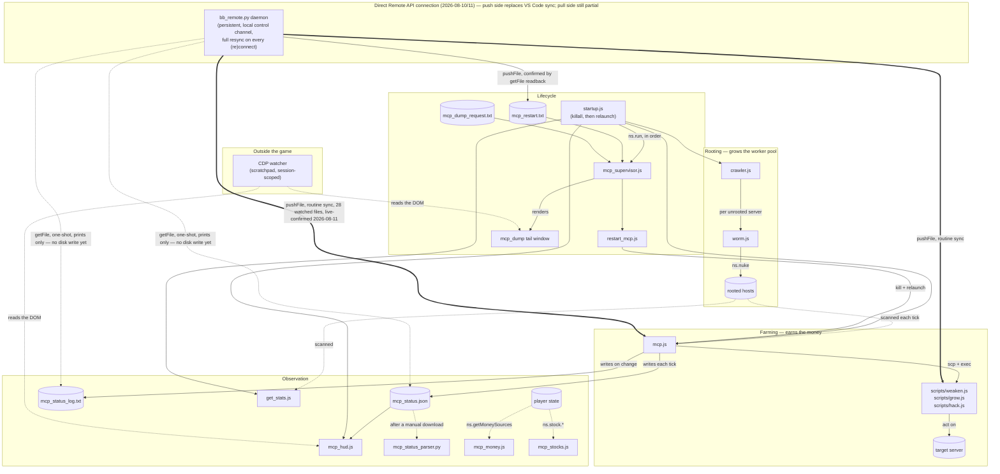

# Processes

What each script is, what it reads and writes, and how they fit together —
from rooting a server through to restarting the bot without a keystroke.

`CLAUDE.md` covers the environment constraints and working rules; the audit
reports in this directory cover *why* the current design is what it is. This
file is the map.

Keep it current. If a script gains an argument, a file, or a failure mode,
it changes here in the same commit.

---

## The map



Three things are worth reading off that diagram:

- **Nothing in `mcp.js` roots servers.** The worker pool only grows while
  `crawler.js` is running and you own the port-opener `.exe`s each server
  needs. If the bot looks starved for RAM, check the crawler first.
- **`mcp_status.json` is the single source of truth for observation.** The HUD
  reads it, the parser reads it, and the out-of-game watcher reads the HUD.
  Nothing downstream re-derives the numbers, so nothing downstream can
  disagree with the orchestrator about what is happening.
- **CDP reads the DOM, not the filesystem.** It can see the HUD's curated
  summary and now a full-file dump once rendered, but it can never call
  `ns.read()` directly — that only works from inside a running script. The
  supervisor's dump feature is the bridge: a local file write in, a rendered
  tail window out.
- **`startup.js` is the only other thing that still needs a human.** Once
  `mcp_supervisor.js` is up, restarts and dumps are remote-triggerable — but
  nothing can remote-*launch* a script that isn't running yet, including the
  supervisor itself. `run startup.js` (it kills everything else itself first)
  is the full recovery procedure after anything that wipes running scripts
  (an augmentation install, primarily).
- **Routine script sync no longer depends on the VS Code extension either
  — the daemon now covers everything the extension did.** As of 2026-08-10,
  `tools/bb_remote.py`'s `daemon` mode pushes every watched live-game
  script/config file (`mcp.js`, `hacking/*`, `scripts/*`, `mcp_config.json`,
  `dnet_*.js`, etc. — see `WATCHED_FILES` in the script) directly into the
  game via `pushFile`: a full push of everything on every game connection
  (first connect or any reconnect after a drop, closing the exact
  "doesn't replay on reconnect" gap `CLAUDE.md` documents), plus an
  incremental only-changed-files push every 2s while connected. The
  restart trigger and file dumps work the same way they did before this:
  `mcp_restart.txt` via `pushFile`+`getFile`-readback, dumps via `getFile`
  directly, bypassing `mcp_dump_request.txt`/tail-window/CDP. **Live-confirmed
  2026-08-11:** the real game connected on port 12526 and a full resync
  pushed all 28 watched files with zero failures. See the `tools/bb_remote.py`
  section below for the full design.
  **This only covers disk → game.** The game → disk direction (pulling
  `mcp_status.json` and friends back out) still has no automated path — see
  `docs/claude-todo.md`'s "game → disk direction" item — so the VS Code
  extension isn't fully unnecessary yet, just for routine edits/restarts.

---

## Rooting

### `hacking/crawler.js`

Breadth-first walk of the network, forever. For each server that is unrooted,
within your hacking level, and not in `IGNORE`, it runs `worm.js` against it.
Sleeps 2 minutes between sweeps.

- **Start:** `run hacking/crawler.js`
- **Reads/writes:** nothing on disk
- **Stop condition:** none, runs until killed

**Known bug:** `let serv_set = Array(servers)` should be `Array.from(servers)`.
`Array(x)` with a single non-number argument produces `[x]` — a one-element
array containing the seed list — so `serv_set.includes(con)` never matches any
of home's immediate neighbours and they get re-queued on every rediscovery.
Wasteful, not fatal: the `hasRootAccess` check makes the repeat visits no-ops.

### `hacking/worm.js`

Opens as many ports as it has `.exe`s for, then `ns.nuke()`s a single server.

- **Start:** normally by `crawler.js`; manually `run hacking/worm.js <server>`
- **Exits early** if the server needs more ports than it can open
- **Dangling reference:** on success against `CSEC`, `avmnite-02h`, `I.I.I.I`,
  or `run4theh111z` it execs `hacking/backdoor.js`, which is **not in this
  repo**. `ns.exec` returns 0 and the failure is silent.

After an augmentation install your `.exe`s are gone and hacking level resets,
so the pool shrinks to what needs no ports. Rebuilding it means Create Program
(or buying from the darkweb) before the crawler can make progress again.

---

## Farming

### `mcp.js`

The orchestrator, and where nearly all the complexity lives. Each tick
(`LOOP_SLEEP_MS`, 10s) it scans the network, decides on a target, decides on a
plan, and allocates worker threads across every rooted host.

- **Start:** `run mcp.js` — optionally `run mcp.js target=<hostname>`
- **Reads:** `mcp_config.json` every tick (see Tunables)
- **Writes:** `mcp_status.json` (every tick, overwritten),
  `mcp_status_log.txt` (appended only when target/plan/bucket changes),
  `mcp_events.txt` (one line per transition),
  `mcp_target_state.json` (exclusions, so they survive a restart)
- **Deploys:** `/scripts/weaken.js`, `/scripts/grow.js`, `/scripts/hack.js`

**`mcp_logic.js` holds the pure decision logic** — `evaluateMoneyDegradation`
(the eviction predicate at the center of the `moneyDegraded`/XP-mode bug
fixed in `81814d6`), `evaluateOpportunitySwitch` (the switch comparison),
`selectWorkWeights`/`getWorkWeightBucket` (the bucket table + hysteresis),
and `computeTickInvariantChecks` (the invariant predicates). No `ns` calls,
no side effects — `mcp.js` imports it the same way `dnet_deploy.js` imports
`dnet_lib.js`, and does all the `ns` calls and mutation itself, calling into
this module only for "given these inputs, what's the decision."

Test it with `node --test mcp_logic.test.js` — runs in well under a second,
no game round trip, and covers the exact regression scenario that took three
live restarts and 4-5 minutes each over CDP to diagnose the night `81814d6`
was fixed. `node --check mcp.js mcp_logic.js` is the syntax-only sanity check
for both files (imports aren't resolved outside the game, so this doesn't
catch a bad import path — only parse errors). **Any future change to the
logic in `mcp_logic.js` should get a test added/run before being shipped** —
see `docs/claude-todo.md`'s workflow note.

**Argument:** `target=<hostname>` pins the target, bypassing selection. It is
validated against the scanned network — a name that isn't a hackable server is
rejected at startup rather than silently ignored.

**The tick, in order:**

1. Scan the network; identify rooted hosts with RAM (`workers`).
2. Compute `maxWeaken` — the weaken threads the pool *could* run if the RAM
   currently held by our own action scripts were reclaimed. Counting only free
   RAM here was the bug that pinned `maxWeaken` at 0 for 98.8% of ticks.
3. If a target is held: check whether it is **stuck** (security not falling)
   or **degraded** (money sustainably low *and* declining, or rate dropped).
   Either marks it excluded and clears the target. The money-degraded half of
   this is disabled entirely in XP mode — see `OBJECTIVE` below.
4. Evaluate the **opportunity switch** — see below.
5. If no target, pick one: highest potential income discounted by readiness.
6. Build a **plan**: `weaken` if security exceeds the cap, otherwise `work`
   with a hack/grow/weaken weighting chosen by how full the target is.
7. Allocate threads per host, redeploying only hosts whose running actions no
   longer match the plan.
8. Write status.

**Target exclusions are preferences, not bans.** If nothing qualifies,
selection reruns ignoring exclusions. Without that fallback the bot livelocked
after an augmentation: it drained its only reachable target, excluded it, and
then sat idle killing scripts every 60 seconds.

**Redeploy is conditional.** Hack, grow and weaken take 60–240 seconds; the
tick is 10. Killing and re-execing every tick meant no action ever completed.
`hostNeedsRedeploy` is what stops that.

#### The opportunity switch

Adoption only happens when there is no current target, and both abandonment
paths assume a target eventually runs dry. Once grow keeps pace with hack, a
target can be farmed sustainably forever — it never degrades and never empties
— so without this the bot would farm the smallest server on the network
indefinitely while richer ones sat untouched.

Two regimes, because the fair comparison differs:

| Current target | Compared on | Minimum hold |
| --- | --- | --- |
| producing nothing (`empty` bucket) | readiness-discounted score | `MIN_TARGET_HOLD_MS` (60s) |
| productive | raw potential | `MIN_TARGET_COMMIT_MS` (600s) |

It switches when the best alternative beats the current one by more than
`OPPORTUNITY_SWITCH_FACTOR` (3×) *and* the hold timer has elapsed.

The predicate is evaluated **every tick** and recorded as `switchEval` in the
status file, even when the hold timer forbids acting on it. That is deliberate:
the two blockers demand different responses. Losing on score means the 3×
factor is what stands between the bot and a richer server. Losing on the hold
timer just means waiting. `blockedBy` names which.

#### Tunables — `mcp_config.json`

**Re-read at the top of every tick. No restart needed.** That matters because
a restart wipes `rateSamples`, `moneyPctSamples`, `totalHacked` and
`lastSwitchTime` — automating restarts made the evidence-destruction cycle
faster, not smaller. Editing the config is the only way to change a constant
and still have the history that says whether it helped.

The ones that actually get retuned:

| Key | Default | What it governs |
| --- | --- | --- |
| `SECURITY_CAP` | 6 | Above this, the plan is pure weaken |
| `WORK_SECURITY_MARGIN` | 1.5 | Absolute headroom kept during `work` |
| `TARGET_MONEY_GOAL` | 0.95 | Money fraction the `goal` bucket aims at |
| `DEGRADED_MONEY_PCT` | 0.05 | Drain threshold — **must** stay below the `empty` bucket's 0.1, and an invariant enforces it |
| `OPPORTUNITY_SWITCH_FACTOR` | 3 | Margin required to abandon a working target |
| `LOOP_SLEEP_MS` | 10000 | Tick length |

Fourteen more numeric keys are configurable; the file in the repo lists all
seventeen (fourteen numeric + `OBJECTIVE`/`XP_WEIGHT_HACK`/`XP_WEIGHT_GROW`,
see below) with their defaults. Rules for the numeric ones: only numbers are
accepted, unknown keys are rejected and reported, and **corrupt JSON keeps
the current values** rather than reverting to defaults — a half-saved file
should not silently undo a deliberate tune. Every change emits a
`config_change` event with a diff, and the effective config rides in
`mcp_status.json` so an edit can be confirmed to have taken.

#### `OBJECTIVE` — money vs. XP

`"money"` (default) or `"xp"`, hot-reloadable like everything else. Validated
as a string enum separately from the numeric tunables — an invalid value is
rejected and reported the same way a bad number is, keeping the current
setting rather than falling back to the default mid-run.

Money mode is the bucket system described above. XP mode does **not** reuse
it — deliberately. `hackExp(server, player)`'s own signature takes no money
or percent argument, confirming hacking XP per completed action is
independent of how much was actually stolen. The entire reason money mode
avoids hacking a
drained target (`empty`: `grow:1, hack:0`) is that a near-zero steal isn't
worth the security cost — a reason that simply doesn't exist for XP. So XP
mode uses one fixed split regardless of `moneyPct`: `XP_WEIGHT_HACK` (default
0.8) and `XP_WEIGHT_GROW` (default 0.2), rendered as a single pseudo-bucket
named `xp` that flows through the same bucket-change machinery money mode
uses (`forceRebalance` still fires correctly when switching objective live).

**That 0.8/0.2 split is reasoned, not measured** — hack has the shortest
cycle time of the three actions, so more threads complete per second, all
else equal. It has not been checked against real exp/sec/thread numbers for
grow or weaken. `econ_probe.js` exists to gather exactly that (see its own
header) and these two numbers are expected to change once real data exists —
that's why they're config keys instead of a hardcoded table.

Target *selection* is unchanged in both modes — still scored by $/s. Making
selection itself XP-aware is a larger, riskier change than reweighting
hack/grow, and is deliberately not happening until real data justifies a
specific formula rather than a guess.

**Money-based eviction is disabled in XP mode.** The 0.8/0.2 split above is
hack-heavy by design, so it drains every target's money toward zero and never
lets it recover (grow is only 20% of the mix) — the `moneyDegraded` check
described under "The opportunity switch"/step 3 above would then read that as
every target "yield degraded" in turn and evict it, chaining from target to
target indefinitely and defeating XP mode's entire point of sitting still to
grind hack XP. Confirmed live 2026-08-09: three evictions in under a minute.
`moneyDegraded` is now unconditionally `false` when `OBJECTIVE === "xp"`;
`rateDropped` (a real stall, not a money read) still applies in both modes,
and the opportunity switch (comparing against a much-better idle target) is
untouched and remains the only way XP mode gives up a target on its own.

#### Telemetry

Three things stamp or check every tick:

- **`runId` + `scriptVersion`.** mcp hashes its own source (djb2 — a retuned
  constant is exactly the same-size edit a length check would miss) and stamps
  it into every status write and every event. `mcp_hud.js` hashes `mcp.js`
  itself and compares, so **version drift shows up as an `OLD CODE` verdict.**
  This exists because the loop now edits code here, lets the sync watcher push
  it, and restarts by writing a token — nobody looks at the game in between,
  so "is the running code the code on disk?" gets asked constantly and was
  previously unanswerable.
- **`formatStatus(status)`** is the single field list. The tail line and the
  log line both derive from it. Add a field to `status`; that function is the
  only place deciding how it renders. Three parallel hand-maintained lists is
  how `lowMoneySeconds` reached `ns.print` only, and `switchEval` the JSON
  only — the same miss, twelve hours apart.
- **Invariants**, which assert on the code's own intentions and never on game
  state. Game state may surprise us; our own bookkeeping may not. A violation
  toasts once per name per run and increments a counter in the status file,
  which the HUD renders and the out-of-game watcher wakes on.

| Invariant | Catches |
| --- | --- |
| `eventLogWrites` | A write to `mcp_events.txt` failing — this is what caught the file's own invalid-extension bug, see below |
| `weakenBudgetNonNegative` | Budget over-allocation, found originally only by an accident of two fields lining up |
| `tickWithinBounds` | The 70–380s ticks that silently multiplied every rate |
| `poolNotIdle` | The network sitting 93% idle during weaken phases |
| `threadsFitHost` | The inconsistent-RAM class (`usedRam 3.5, freeRam 16, maxRam 16`) |
| `drainBelowEmptyTier` | A config edit that would strand recovering targets |
| `configParses` | A malformed `mcp_config.json` |

### `mcp_events.txt`

Content is JSON-lines (one JSON object per line), but the extension is
`.txt`, not `.jsonl` — Bitburner's `ns.write` only accepts a path ending in
`.txt`/`.json`/`.css` or a script extension; anything else throws `File path
should be a text file or script`. This is the same bug class as the `.log`
lesson elsewhere in this project, and it hit this file specifically for its
entire first day: every write threw, caught by a try/catch and printed only
to `ns.print`, so the file never actually existed in the game — invisible
because the in-memory ring buffer that feeds `recentEvents` in the status
file kept working regardless of whether the write succeeded, so everything
*looked* fine. Found only by checking why a correctly-set download pattern
still wasn't pulling the file down. Now caught structurally: a write failure
here trips the `eventLogWrites` invariant, so a future extension mistake
toasts instead of vanishing silently.

One line per transition — `startup`, `target_adopt`, `target_drop`,
`degraded_held`, `plan_flip`, `bucket_change`, `stall`, `config_change`,
`invariant_violation`. Never per tick.

The rule that makes it worth having:

> An event records the value of every variable that appeared in the predicate
> that fired it — not the state afterward.

So a `target_drop` for `drained` carries the whole sample array, `declining`,
`rateDropped`, `lastAvgRate`, `heldMs` and every threshold involved. A wrong
theory dies on reading. The same event carrying only `{reason: "drained"}`
costs three restart cycles to disambiguate, because the reader has to infer
backwards from effect to cause — which is exactly where this project
repeatedly lost hours.

Trimmed to the last 300 lines at startup, so it stays bounded inside the save
file while still surviving the restarts that wipe every in-memory sample. The
most recent 20 also ride inline in `mcp_status.json`, so one read gives both
"now" and "how we got here".

### `scripts/weaken.js`, `scripts/grow.js`, `scripts/hack.js`

Three lines each: loop forever calling the one NS function on `ns.args[0]`.
All the intelligence is in how many threads `mcp.js` starts and when it kills
them. Keeping them dumb is what makes thread count the only control surface.

`mcp.js` copies these to each worker itself; it does not use the helpers in
`scripts/`.

---

## Observation

### `mcp_hud.js`

The terse panel — "is it healthy?" at a glance, sized to sit under the game's
own Overview.

- **Start:** `run mcp_hud.js` — optional `x= y= w= h=` in pixels
- **Reads:** `mcp_status.json`. It measures nothing itself, so it cannot
  disagree with the orchestrator.
- **Cost:** ~2.35GB (1.6GB baseline plus `ns.ps` + `ns.kill`)
- Re-running supersedes the previous instance instead of opening a second
  window, so repositioning is just a re-run — and now closes that instance's
  window too, not just its process. `ns.kill` alone doesn't close a script's
  tail window; found by observation after two `startup.js` runs left two
  visibly different "mcp" panels open while `ps` showed only one live
  process — the second was a frozen ghost from the instance the previous run
  had already killed. Fixed with `ns.ui.closeTail(pid)`, which exists
  specifically to close a window belonging to a script other than the
  caller. This only prevents *future* ghosts — a window already orphaned by
  an older, now-dead process has no live PID left for `ns.ps` to find, so it
  can't be closed programmatically and needs one manual click.

```
+--------------------------+
|OK              foodnstuff|   verdict + target
|plan                  work|
|money 93%         sec 5.42|
|rate 112k       avg 98.00k|
|wkn 40/210    w40 g300 h12|   needed/available, then live threads
|ram 97%           19 hosts|
|lvl 341     earned 45.20m|   see below
|next phantasy       1.8/3x|   see below
|ver ok               inv 0|   code drift, invariant violations
|tick 10.1s          age 0s|
|x=950                y=190|   see below
+--------------------------+
```

The first word is a verdict, and every line beneath it carries an input to
that verdict, so it never asks you to trust the summary alone. In priority
order:

| Verdict | Meaning |
| --- | --- |
| `NO DATA` | No readable `mcp_status.json` |
| `STALE` | Status older than 90s — mcp is wedged or dead |
| `OLD CODE` | The running mcp does not match `mcp.js` on disk |
| `INVARIANT` | One of mcp's own assertions has failed |
| `WEAKEN` | Needs more weaken threads than the pool can supply |
| `DRAINED` | Average money share below the drain threshold |
| `SLOW` | Tick longer than 30s |
| `OK` | — |

`OLD CODE` outranks every health signal deliberately: if the running code is
not the code on disk, every judgement below that line is about the wrong
program, and the fix is a restart rather than a diagnosis.

`age` matters nearly as much: without it, a dead `mcp.js` would leave the panel
showing frozen-but-plausible numbers indefinitely.

The `ver`/`inv` row is always rendered, including its reassuring zeros, so the
panel's height never changes — `placeTail` sizes once, and a row appearing
later would clip.

The `next` row renders `switchEval` in three states:

| Shown | Meaning |
| --- | --- |
| `= current` | Nothing outranks the current target. Working as intended. |
| `hold 460s` | A better target exists; the commit timer is still running. |
| `1.8/3x` | A better target exists but isn't winning by enough. |

The `lvl`/`earned` row shows `ns.getMoneySources().sinceInstall.hacking +
.crime` — cumulative, only ever added to by the game itself, so spending
(Hacknet, servers, anything) can never move it. This exists because total
player money couldn't answer "is anything actually earning" once heavy
Hacknet spending became routine — see the out-of-game watcher section below.
"Since install," not "since start," so it survives script and game restarts
and only resets on an actual augmentation install.

The `x=`/`y=` row echoes back whatever position was actually applied — the
args passed in, or the computed default if none were. Bitburner exposes no
getter for a tail window's current position or size anywhere in the `ns.ui`
cost table (checked directly, not assumed), so a manual drag can never be
read back by a script. This is the substitute: dialing in a position is
"adjust the number, see where it lands, read the confirmation," not "drag,
then capture." Every panel in this project that supports `x=`/`y=` carries
this same row for the same reason.

### `mcp_money.js`

A second small panel, independent of the HUD — start/stop/roll-up like any
tail window — answering a different question: not "is the bot healthy" but
"where is money actually coming from and going." Reads
`ns.getMoneySources().sinceInstall` directly (not `mcp_status.json` — this is
whole-player accounting, not specific to the bot's own target, so there's no
orchestrator-disagreement risk to design around).

- **Start:** `run mcp_money.js` — optional `x= y= w= h=`, same as `mcp_hud.js`,
  same echo-row substitute for the missing position getter
- **Cost:** 3.3GB (1.6GB baseline + `ns.getMoneySources` 1.0GB + `ns.ps`
  0.2GB + `ns.kill` 0.5GB)
- Shows every non-zero category, sorted by magnitude, plus a `total` line.
  Expense categories (`hacknet_expenses`, `gang_expenses`) render as negative
  numbers with no special-casing needed — confirmed against the game's own
  code, not assumed: `loseMoney()` calls
  `recordMoneySource(-1 * amount, category)`, so the sign is already correct
  at the source.

```
+------------------------------+
|since last aug                |
|total                    3.06b|
|hacking                  4.20b|
|hacknet_expenses         -890m|
|crime                     320m|
|hacknet                 15.00m|
|x=1050                   y=430|
+------------------------------+
```

### `mcp_stocks.js`

Read-only stock market panel — groundwork for trading, not trading itself.
**Never references `buyStock`/`sellStock`/`buyShort`/`sellShort`/
`placeOrder`/`cancelOrder` anywhere in the file, so it cannot move money**
regardless of what runs it or with what args. Answers three questions: do we
have WSE/TIX access, what (if anything) are we holding, and — once 4S Data
is bought — what looks worth buying.

- **Start:** `run mcp_stocks.js` — optional `x= y= w= h=`, same echo-row
  substitute for the missing position getter as every other panel here.
- **Cost:** 11.45GB (1.6GB baseline + `ns.ps` 0.2 + `ns.kill` 0.5,
  self-supersede + `stock.hasWseAccount`/`hasTixApiAccess`/`has4SDataTixApi`
  0.05 each + `stock.getSymbols`/`getPrice`/`getPosition` 2.0 each +
  `stock.getForecast`/`getVolatility` 2.5 each). Not in `startup.js`'s
  `SCRIPTS` list — same as `mcp_money.js`, it's an opt-in panel, not part of
  the always-on suite.
- Without 4S Data **TIX API access specifically** — a separate purchase from
  the UI-only 4S Market Data, `purchase4SMarketDataTixApi` vs
  `purchase4SMarketData` in the game's own function list — `getForecast`/
  `getVolatility` have no real signal, so the panel skips a ~30-row
  undifferentiated symbol dump in favor of one `watchlist locked (buy 4S)`
  line. Buying the TIX API variant needs no script change — the watchlist
  (top 10 symbols by `|forecast - 0.5|`, i.e. strongest directional signal)
  activates on the next poll.
- **First live run (2026-08-09) threw a runtime error**: the original code
  gated the watchlist on `has4SData()` (general 4S UI access), but
  `getForecast`/`getVolatility` actually check `has4SDataTixApi` internally
  (confirmed in source: `if(!r.ai.has4SDataTixApi)throw ...`) — two
  genuinely different flags. Since a runtime error inside `buildLines`
  discards the whole line array via the outer `catch`, the crash also hid
  an already-open position, not just the watchlist. Fixed by gating on
  `has4SDataTixApi()` instead; the error-display path was also widened from
  a single 34-char slice to up to 6 wrapped lines, so a future misdiagnosis
  like this one doesn't require re-deriving the cause from source again.
- **Confirmed against source, not assumed:** the augmentation-install reset
  wipes stock *positions* but not `hasWseAccount`/`hasTixApiAccess` — those
  clear only on a BitNode-prestige reset, a different and much rarer path.
  So this panel can legitimately show live TIX access with 0 positions
  immediately after an install, which is exactly what it showed on
  2026-08-09's install.

```
+----------------------------------+
|wse/tix                   yes/yes|
|4S tix                     locked|
|positions                       0|
|long value                     0 |
|short value                    0 |
|(no positions)                   |
|watchlist          locked (buy 4S)|
|x=1050                      y=640|
+----------------------------------+
```

### `get_stats.js`

The wide view: one line per rooted server with money, security, RAM and what
it is currently running. Auto-sizes its tail window to the text using real
font metrics from `ns.ui.getStyles()`, and parks itself beside the sidebar by
default.

- **Start:** `run get_stats.js`, or `run get_stats.js <server> [<server>…]`
  to restrict it — `x=`/`y=`/`w=`/`h=` also accepted, mixed in with server
  names in any order. They're filtered out by pattern (`/^[xywh]=[\d.]+$/`)
  before the remaining args are read as hostnames, so a real server named
  e.g. `xylophone` is never mistaken for a stray `x=` — verified before
  shipping, not just assumed safe.
- **Reads:** the live game. This one *does* measure independently.
- Carries the same `x=`/`y=` echo row as `mcp_hud.js`, for the same reason —
  no way to read a window's position back after a manual drag.

### `mcp_status.js`

Mirrors `mcp.js`'s tail output into its own window, so the orchestrator's
`ns.print` lines stay visible without hunting for its tail.

- **Start:** `run mcp_status.js [host] [lines]` (defaults `home`, 20)
- `tail_mcp.js` is a near-identical earlier version. Prefer `mcp_status.js`.

### `mcp_status_parser.py` / `mcp_status_parser.js`

Local, out-of-game. Pretty-prints `mcp_status.json` including per-host
allocations, once that file has been pulled out of the game.

**As of 2026-08-11, `tools/bb_remote.py`'s daemon does not yet pull this
file automatically** — its game→disk direction is limited to one-shot
`get`/`dump`/`ctl-get`/`ctl-dump`, which fetch via the same live `getFile`
RPC the push round trip uses but only print the result to stdout/the
control socket, not write it to disk. Getting a fresh copy of
`mcp_status.json` onto disk still needs **either**:

- the VS Code extension's **Download Files Matching Pattern…**, exactly
  `mcp_*.{json,txt}` (never bulk-download — see `CLAUDE.md` for why that
  overwrites local source and pushes the stale copy back), or
- a CDP read via `mcp_dump_request.txt` (see below) — no download needed.

See `docs/claude-todo.md`'s "game → disk direction" item for the
recommended fix (extend the daemon with a pull loop, same shape as its
existing push loop) — until that's built, the extension isn't fully
retired, just half.

Largely superseded by reading the game directly over CDP, but it still works
and needs nothing running.

---

## Lifecycle

Bitburner does not hot-reload. A running script keeps executing the version it
started with, so every code change needs a kill and relaunch. These two close
that loop.

### `restart_mcp.js`

Kills `mcp.js` on home, waits for it to actually be gone, relaunches it with
whatever args it was given.

- **Start:** `run restart_mcp.js [target=<hostname>]`

It polls `ns.scriptRunning` against a 10s deadline rather than sleeping a fixed
interval. A killed script can still finish its in-flight tick, including
writing `mcp_status.json` and `mcp_target_state.json` — starting the
replacement on a timer races those writes, and the new instance can load target
state the old one is about to overwrite.

### `mcp_supervisor.js`

Watches two files for requests from outside the game. Both use token
comparison rather than deleting a flag, to keep RAM down: `ns.read` costs
0GB and returns `""` for a missing file, so neither needs `ns.fileExists`
(0.1GB) or `ns.rm` (1GB). Both seed from whatever is already on disk at
startup, so restarting the supervisor doesn't immediately re-trigger on a
stale token.

- **Start:** `run mcp_supervisor.js` — **this one still needs a human, once**
  (and again after any update to this script — Bitburner doesn't hot-reload,
  and the supervisor can't remote-restart itself; it self-supersedes on
  re-run so a second `run` cleanly replaces the first rather than stacking)
- **Cost:** 3.3GB — 1.6GB baseline + `ns.run` (1.0GB) + `ns.ps` (0.2GB) +
  `ns.kill` (0.5GB, for self-supersede). Every `ns.ui.*` call the dump
  feature uses is 0GB (checked against the game's own cost table, not
  assumed), so rendering itself added nothing to that figure.

**`mcp_restart.txt`** — runs `restart_mcp.js` when its contents change. First
line is a token, any further lines are passed to `mcp.js` as arguments (so
`target=n00dles` can be requested remotely).

**`mcp_dump_request.txt`** — renders a file's full contents into a tail
window titled `mcp_dump`, readable over CDP without a download. This exists
because the CDP connection can only read what's already rendered on
screen — the HUD deliberately shows a curated ~10-line summary, not full file
contents, and nothing outside the game can call `ns.read()` directly, since
that only works from inside a running script. Every deep-log finding this
session (the bucket-hysteresis thrashing, the invalid-extension write
failure) needed the actual file, which until this existed meant a manual
download every time.

- **Protocol:** line 1 a token/nonce (forces change-detection even when
  re-requesting the same file), line 2 the filename, optional line 3 a line
  count for non-JSON files
- `.json` files are pretty-printed whole (with a raw fallback if the content
  doesn't parse); everything else is tailed to the last N lines — default
  150, hard-capped at 500 regardless of what's requested, since
  `mcp_status_log.txt` has no size limit of its own and a request shouldn't
  be able to try rendering an unbounded file into the browser tab
- **Resolved, the hard way:** Bitburner's tail window only keeps in the DOM
  whatever fits its actual configured height — it is not a scrollable div
  with everything present underneath. A 100-line request originally rendered
  only ~45 lines over CDP (always the tail end); a 45-line request rendered
  completely. The window's height was being capped at 700px for assumed
  visual tidiness, silently dropping content CDP could read even though
  `ns.print` genuinely wrote all of it. Fixed by sizing the window tall
  enough to fit whatever was requested, uncapped, since nothing about this
  feature is optimizing for how the window looks.
- **Open, milder variant of the same bug (2026-08-09):** dumping
  `mcp_status.json` over CDP showed only the tail (`recentEvents`, the last
  field in the object) — the `config` block, inserted well before it, never
  appeared, even though the doc above says `.json` renders whole. The window
  resize itself isn't capped anymore, so this is likely the *screen's*
  height clipping DOM content the window is sized taller than, not a
  reintroduction of the 700px cap — unconfirmed. Didn't block anything this
  time (OBJECTIVE's new value was independently confirmed via the terminal's
  `config updated` log line and the HUD's `plan` row), so not chased further
  yet. Worth a real fix if a future dump genuinely needs a large JSON file's
  earlier fields and nothing else confirms them.

### `startup.js`

Brings up the whole suite from a clean slate in **one** command:
`run startup.js`. Closes every open tail window, kills everything else on
the host, then launches `mcp_supervisor.js`, `hacking/crawler.js`, `mcp.js`,
`mcp_hud.js`, `get_stats.js` in that order via `ns.run`, then exits rather
than staying resident, so its own footprint doesn't compete with what it
just started.

- **Start:** `run startup.js` — the one command besides the supervisor's own
  bootstrap that still needs a human hand
- **Cost:** 4.3GB while running (momentary) — 1.6GB baseline + `ns.ps`
  (0.2GB) + `ns.killall` (0.5GB) + `ns.scriptRunning` (1.0GB) + `ns.run`
  (1.0GB)
- **Closes tail windows *before* killing, not after — order was a real bug.**
  `ns.kill`/`ns.killall` never close a script's tail window; it's orphaned,
  frozen on whatever it last rendered. `closeTail` needs a live PID from
  `ns.ps` to target, and `killall` erases that PID the instant it runs. Two
  actual `startup.js` runs each left a fresh ghost behind for `mcp_hud.js`
  and `get_stats.js` despite both scripts' own self-supersede logic already
  calling `closeTail` — their check runs from the *new* instance scanning
  `ns.ps` for a prior copy, and by the time it ran, `startup.js`'s own
  `killall` (which used to run first) had already erased that evidence. Now
  closes every window it can see, then kills.
- **Calls `ns.killall(host)`** — every other script on the host, including
  anything unrelated to the mcp suite, since "clean and fresh" was the
  explicit ask. Safe against killing itself: `safetyGuard` defaults to
  `true`, documented as "skips the script that calls this function" and
  confirmed against the actual implementation in the game's bundle (it
  compares the target PID to the caller's and excludes a match), not just
  the doc text.
- Still checks `ns.scriptRunning` before each launch even though `killall`
  already cleared the host — cheap, and belt-and-suspenders against an edge
  case rather than the primary duplicate-prevention it was before `killall`
  got folded in. Checked *without* passing arguments, since the function
  matches "any script with this filename" regardless of what it was started
  with (confirmed against the game's own doc text); a live
  `mcp.js target=n00dles` still correctly reads as running.
- `mcp_supervisor.js` launches first deliberately: once it's up, restarts and
  file dumps are remote-triggerable, so everything after it in the list is in
  principle also recoverable without repeating this script.
- Reports per-script outcome (`started (pid N)` / `already running,
  skipping` / `FAILED — not enough RAM?`) plus a one-line summary count, so a
  partial failure from insufficient home RAM is visible rather than silent.

---

## Outside the game

### The CDP watcher

Not in this repo — it lives in the session scratchpad, because it is
session-scoped by nature.

Bitburner runs under Electron. Launched with `--remote-debugging-port=9222`,
its page is reachable over the Chrome DevTools Protocol, which means the DOM —
including the Overview panel and every open tail window — can be read from
outside. `appSaveFns` is also exposed on the page.

A small Node poller reads that every 60s and prints a line **only when the
health state changes**: a non-`OK` HUD verdict, no money and no XP gain for ten
minutes, or the game becoming unreachable. Attached to a monitor, each printed
line wakes Claude mid-session without anyone typing.

This is why the HUD's verdict word is the first thing on the first line: it is
the machine-readable handle. Anything that lands there becomes something that
can raise an alarm.

**Limits worth stating plainly.** It dies when the session ends — it is not a
daemon. Each event costs a turn, which is why the filter watches transitions
rather than ticks. And it observes; it does not act.

### The status dashboard

`docs/status-dashboard.html` (git-tracked source) is a published Artifact —
the standing "needs your call / in progress / done this session" page built
2026-08-09 after Ken flagged chat as too noisy to actually use. Claude
**redeploys it in place** whenever there's something new for Ken to see or
decide; it is not appended to over chat, and chat goes back to short pings
("dashboard has one thing for you") once it exists.

**Two separate publishing surfaces exist, and they do not share state —
found the hard way 2026-08-11.** The original was published via claude.ai's
classic Artifact tool at
<https://claude.ai/code/artifact/a48a824c-7762-4b20-9e22-9f1827002e90>, last
redeployed 2026-08-10 13:40 from a session on that surface. **A session
running in Cowork mode cannot reach or update that URL at all** — Cowork has
its own separate artifact system (`mcp__cowork__create_artifact` /
`update_artifact`), which persists to the Cowork sidebar under its own ID,
not a public URL. Editing `docs/status-dashboard.html` alone updates neither
surface by itself; publishing requires calling that surface's own tool.
Ken spent a whole exchange looking at the stale claude.ai-hosted copy while
this session had already rebuilt the file, because nothing had redeployed
to the surface he was actually checking.

**Current state:** a Cowork artifact was created 2026-08-11, id
`bitburner-status-dashboard`, visible in the Cowork sidebar for this
workspace — no external URL. **Whichever surface a session is running on
(Cowork vs. claude.ai chat) is the one it must redeploy to** — check which
one Ken is actually looking at before assuming a file edit was enough.
If future sessions run outside Cowork again, the original claude.ai URL
above may still be the one in front of Ken; don't assume the Cowork
artifact replaced it for him, ask if unsure which he's checking.

### `docs/claude-todo.md`

Claude's own granular, session-spanning working list — distinct from
`docs/kensTodo.md` (Ken's-hand-only actions) and this file (what the code
does). Read first at the start of every session, updated as work happens.
Not part of the script map above; noted here only so it doesn't get missed
alongside the other two standing docs.

### `tools/bb_remote.py` — direct Remote API client (prototype, not yet cut over)

Built 2026-08-09 to replace the VS Code extension's file-sync as the write
path into the game, after two same-day incidents where writes to
`mcp_dump_request.txt`/`mcp_restart.txt` never reached it (dropped sync
session, no replay on reconnect — see the `CLAUDE.md` note this traces to).
Full protocol writeup, citations, and validation status:
`docs/remote-api-migration.md`. Short version: the game dials **out** as a
WebSocket client to an external server (Options → Remote API → hostname
`localhost`, port `12525`, Connect); `tools/bb_remote.py` is a second
implementation of that server, alongside the extension's own. Protocol
self-tests pass against a spec-accurate mock; **not yet round-tripped
against the live game** — that needs one supervised, reversible action from
Ken (see the doc). Not wired into `mcp_supervisor.js` or anything
live-running yet; this is groundwork, not the cutover.

**2026-08-10: found and fixed a confirmed connect-then-drop bug, added
logging.** A first live attempt (port 12526) connected then dropped within
seconds with no clue why — `RemoteApiServer`'s connection lifecycle logged
*nothing* on connect/disconnect. Fixed: every connect, disconnect (with
close code/reason/duration), refused second connection, and sent/received/
dropped message now logs to stdout and appends to
`tools/bb_remote_events.log` (gitignored; `--log-file` to override, empty
string to disable). Full trail: `docs/remote-api-diagnosis-log.md`.

While adding that logging, reproduced the actual bug live: `cmd_serve`
read commands from `sys.stdin.readline()`, and on a non-interactive stdin
(no controlling TTY — exactly how a tool-driven launch invokes it),
`readline()` returns `''` immediately, which the old code treated as
`quit` and tore the just-accepted connection down within about a second —
confirmed with a real client against the pre-fix commit (`ping` failed at
t+1.02s with a clean `1000` close). Fixed: `serve` now only reads
interactive commands when stdin is a real TTY; otherwise it holds the
connection open and logs heartbeats instead. Also added a `watch`
subcommand (`python3 tools/bb_remote.py watch --port 12526 --duration
180`) — binds and logs every connect/disconnect for a bounded duration,
no stdin interaction at all, built specifically for an unattended/
tool-driven live test.

**2026-08-10, later: full round trip confirmed against the live game.** A
detached `watch`-style listener caught a real connection (`bitburner/3.0.1`
user agent, not a mock) and a combined script ran `pushFile` → `getFile` →
compare → `getFileNames` in one continuous session: the pushed content
came back byte-identical (`ROUND TRIP MATCH`) and the pushed filename
showed up in `getFileNames`'s listing. This is the bar this doc previously
called "not yet round-tripped" — it's now met, with no VS Code extension
involved at any point. Full trail: `docs/remote-api-diagnosis-log.md`.

One thing to check before building further on this connection: the
`getFileNames` response in that same round trip included entries like
`.venv/lib/python3.9/site-packages/.../entry_points.txt` and
`.claude/settings...` alongside real game scripts — the game's view of
`home`'s filesystem appears to include more of the local repo tree than
intended. Not investigated yet, just flagged.

#### The trigger-file replacement (built 2026-08-10, same session)

`mcp_restart.txt`/`mcp_dump_request.txt` were the only remote-trigger
channel into the game, and both had already failed once each on
2026-08-09 when the extension's sync silently dropped. `tools/bb_remote.py`
now has two layers that replace that dependency for these two specific
actions:

**One-shot commands** (`restart`, `dump`) — same connect/act/disconnect
pattern as `push`/`get`:

- `python3 tools/bb_remote.py restart [--target <hostname>]` — pushes a
  fresh `mcp_restart.txt` (millisecond-timestamp token, optional
  `target=<hostname>` line) via `pushFile`, then reads it back via
  `getFile` to confirm the write actually landed — synchronous and
  confirmable, unlike a local disk write that just hopes the extension
  eventually syncs it. `mcp_supervisor.js`'s poll loop is **unchanged**:
  it still just watches `mcp_restart.txt` for a content change and runs
  `restart_mcp.js`. Only the delivery path changed.
- `python3 tools/bb_remote.py dump <filename> [--lines N]` — fetches a
  file's content directly via `getFile` and prints it (pretty JSON, or
  raw/tailed text). This **bypasses `mcp_dump_request.txt`, the tail-window
  render, and CDP entirely** — that whole path existed only because CDP
  can't call `ns.read()` directly, and this doesn't go through CDP at all.
  `mcp_supervisor.js`'s dump-request handling is left in place as a
  fallback, not removed.

**Daemon + local control channel** (`daemon`, `ctl-status`, `ctl-restart`,
`ctl-dump`) — the recommended path for routine use, added after a design
review flagged that the one-shot commands above re-do the game handshake
on every single call, which is exactly the fragile step this migration
exists to get away from (both prior failures — the extension's dropped
sync, and `tools/bb_remote.py`'s own now-fixed connect-then-drop bug —
were connection-*stability* problems, not request-shape problems). A
one-shot process also exits immediately after, taking any diagnostic
evidence with it.

- `python3 tools/bb_remote.py daemon [--port 12526] [--control-port
  12527]` — a **persistent** process, started once (e.g. `nohup ... &
  disown`, confirmed via `ps -o ppid` reparenting to `launchd`/PID 1 so it
  survives past the session that started it), that holds the game-facing
  `RemoteApiServer` open for its entire lifetime and also serves a
  loopback-only local control socket. Every connect/disconnect still logs
  to `tools/bb_remote_events.log` for the whole time it runs, so a drop is
  visible in one continuous log instead of a fresh unknown per call.
- `python3 tools/bb_remote.py ctl-status|ctl-restart|ctl-dump
  [--control-port 12527]` — cheap local calls (one JSON line in, one JSON
  line out, over `127.0.0.1:<control-port>`) that ask the already-running
  daemon to act, using its already-open game connection. No game handshake
  on this path at all; if the daemon isn't running, these fail fast with a
  clear "could not reach daemon control port" error instead of a 60s
  timeout.

The daemon **cannot** force the game to reconnect after a drop — the
diagnosis log already established the game does not auto-reconnect
regardless of the "Reconnection delay" field, so a fresh drop still needs
one human Connect click regardless of transport. What it removes is the
need to **restart a process** on Claude's side for that reconnect to be
picked up: the daemon just keeps listening.

#### Routine script sync (added 2026-08-10 — the actual VS Code cutover)

Everything above only replaced the restart trigger and file dumps — routine
edits to `mcp.js`/`hacking/*`/`scripts/*`/etc. still reached the game
**only** via the VS Code extension's own file-sync watcher, confirmed by
directly re-reading `tools/bb_remote.py`'s code and its own docstring
("NOT meant to replace the VS Code extension's role for ongoing *source*
file sync ... that stays on the extension/port 12525 for now"). Ken
reconnecting the extension on port 12525 this same session dropped the
daemon's game-side connection on 12526 outright (`close_code=1005`, exact
timestamp match) — confirming directly, not just by protocol reading, that
**the game holds exactly one outbound Remote API connection regardless of
which port is configured**, so the two-port design (12525 for the
extension, 12526 for the daemon) was never actually coexisting; whichever
one the game's Options panel points at wins, full stop.

Fix: `daemon` now also pushes `WATCHED_FILES` — every file that actually
loads into the game (28 as of this writing: `mcp.js`, `mcp_logic.js`,
`mcp_config.json`, everything under `hacking/` and `scripts/`, the
`dnet_*.js` set, `mcp_hud.js`/`mcp_money.js`/`mcp_stocks.js`/
`mcp_status.js`/`mcp_supervisor.js`, `get_stats.js`, `restart_mcp.js`,
`startup.js`, `tail_mcp.js`, `econ_probe.js`, `purchaseServer-8GB.js` —
deliberately excludes generated game-output files, `mcp_logic.test.js`,
the two `mcp_status_parser.*` local tools, and editor-only files like the
`.d.ts`s):

- **Full resync on every game (re)connection** — `RemoteApiServer` gained
  an `on_connect` hook; `TriggerDaemon` registers one that pushes every
  watched file's current on-disk content, unconditionally, the instant the
  game connects (first connect or any reconnect after a drop). This is the
  actual fix for the flaw this whole migration exists to get away from —
  a drop can no longer leave the game silently running stale code, because
  reconnecting always re-pushes everything rather than only resuming
  incremental watching from that point forward.
- **Incremental push every 2s while connected** (`SYNC_POLL_S`, matches
  `mcp_supervisor.js`'s own poll interval) — only files whose content
  differs from what was last successfully pushed, so an idle daemon
  doesn't spam `pushFile`.
- New CLI: `ctl-push <remote> <local>` / `ctl-get <remote>` (the daemon's
  generic push/get control-channel handlers, already present, now exposed
  as commands — for a one-off file outside `WATCHED_FILES`) and
  `ctl-resync` (force an immediate full pass on demand — the same logic
  the connect hook runs automatically). `daemon --no-sync` disables all of
  this and falls back to exactly the restart/dump-only behavior from
  before this feature, for isolating a regression.

**Port decision: daemon stays on 12526; Options gets pointed there once and
left there — it does not take over 12525.** The alternative (daemon binds
12525, the extension's own long-standing port, so Options never needs to
change at all) was considered and rejected: port 12525 is held by the VS
Code extension's own background listener the whole time VS Code is open
with the extension active (confirmed via `lsof` — a `Code Helper` process
holds it), so taking that port over would require Ken to quit or disable
the extension first — a real manual step, and a less familiar one than a
field he's already changed several times today. Pointing Options at 12526
is exactly as durable: the game's Remote API host/port setting persists
across sessions, so this is genuinely one click, not a recurring one — the
same way it would be for 12525. The daemon can't be dropped back onto by
an unrelated "reconnect the extension" action either, since after this
change there is no reason to ever touch the extension again. See
`docs/kensTodo.md` for the exact click.

**Live status as of 2026-08-10, end of this session:** validated at three
levels short of a live-game round trip — (1) `selftest` (`python3
tools/bb_remote.py selftest`) now covers the new sync logic directly:
full resync pushes all present watched files under their leading-slash
remote name, correctly reports a missing file without raising, incremental
resync is a no-op when nothing changed and pushes only the one file that
did change, all passing against an in-process mock game client; (2) a real
`daemon` subprocess (scratch ports, not the live 12526) answered
`ctl-status`/`ctl-resync`/`ctl-push` correctly while disconnected —
`ctl-status` reported `sync_enabled: true`/`watched_files: 28`, a
disconnected `ctl-resync` reported all 28 as failed-not-crashed (each
`pushFile` correctly raised "Not connected to Bitburner" and was caught
per-file), `ctl-push` failed cleanly the same way; (3) that same run
confirmed **all 28 `WATCHED_FILES` paths resolve against the real repo
tree with zero "missing"** — the list is accurate as of this commit. A
fresh daemon (replacing the earlier restart/dump-only one, same port
12526) is running now, `nohup`'d and reparented to launchd (confirmed via
`ps -o ppid`), waiting for a connection. **Not yet confirmed against the
live game** — no live `pushFile`/`getFile` round trip has run against this
session's code; that needs the Connect click in `docs/kensTodo.md`.

---

## Darknet (`ns.dnet`)

A self-contained set, separate from everything above. It does not touch
`mcp.js` and is **not** auto-started by `startup.js` or `mcp_supervisor.js` —
deliberately, until it has worked by hand at least once.

**None of it has run in Bitburner yet.** Design reasoning lives in
`docs/darknet-functions.md` (API reference, model solvers, RAM costs),
`docs/darknet-tactics.md` (per-decision reasoning) and
`docs/darknet-strategy.md` (sequencing). The next real action is running
`dnet_probe.js` — see `docs/kensTodo.md`.

| File | Runs on | RAM (est.) | What it does |
| --- | --- | --- | --- |
| `dnet_probe.js` | `home` | ~2.3GB | First contact. Probes, reports each neighbour's details, attempts `authenticate("darkweb","")`. Mutates almost nothing. |
| `dnet_lib.js` | — | 0GB alone | Shared module. Model-aware password candidates, credential store, session acquisition. Not runnable. |
| `dnet_deploy.js` | `home`, then darknet | ~4.6GB | Roaming self-replicating deployer. Cracks, persists, spreads, follows mutations. |
| `dnet_loot.js` | a darknet server | ~5.0GB | Frees blocked RAM (gated on the free `getBlockedRam`), opens `.cache` files, reports karma spent. |
| `dnet_creds_merge.js` | `home` | ~2.0GB | Folds per-host credential shards into `dnet_creds.txt`. |

### Arguments

- `dnet_deploy.js` — `--once` (single pass, no loop), `--brute N` (allow up to
  N numeric candidates per host; default 0 = off), `--quiet`.
- `dnet_loot.js` — `--no-cache`, `--no-ram`, `--max-realloc N` (default 25).
- `dnet_creds_merge.js` — `--prune` (delete shards after merging), `--quiet`.

### Files

| File | Written by | Notes |
| --- | --- | --- |
| `dnet_creds.txt` | `dnet_deploy.js`, `dnet_creds_merge.js` | JSON-lines, one record per line: `{host, password, model, at}`. `.txt` not `.jsonl` — `ns.write` rejects `.jsonl`. Carried along on every `scp` so a child agent inherits what its parent knew. |
| `dnet_cred_<host>.txt` | `dnet_deploy.js` | Per-host shard, scp'd to `home`. Sharded so concurrent agents can't clobber one shared file. Hostnames are escaped (`meta:inc` → `metax3ainc`) because darknet hostnames contain `:`, `%`, `@` and emoji. |

Both are game output and should be gitignored if they ever land locally.
`dnet_creds.txt` is worth adding to the download pattern once the system is
live, so its contents are readable outside the game.

### Failure modes worth knowing

- **Response code 408 (`RequestTimeOut`) does not mean "wrong password."** The
  game rolls the instability timeout *after* the attempt resolves, so a correct
  password can return 408. `dnet_lib.js` retries 408 with the same password and
  only drops a candidate on 401. Any code that gets this wrong silently skips
  the right answer.
- **Backdoors, not authentications, drive instability.** Free allowance is 2;
  each one past that adds 3% to the global authentication timeout chance,
  capping at 50%. `dnet_deploy.js` never backdoors.
- **`openCache` costs karma** (`difficulty + 1` per cache). `dnet_loot.js`
  reports the total per run.
- **A stored password that starts returning 401** means the server restarted
  with a new one. `dnet_deploy.js` drops the stale credential and re-cracks.

---

## Legacy and unused

Kept because they cost nothing and occasionally get read, but not part of any
current path. Nothing below is called by `mcp.js`.

| File | Status |
| --- | --- |
| `scripts/copyScripts.js`, `scripts/copy_scripts.js` | Byte-identical duplicates. `mcp.js` has its own `copyActionScripts`. |
| `scripts/execute.js` | Manual one-host deploy from before `mcp.js`. Calls `copy_scripts.js`. |
| `scripts/weakenGrowHack.js` | Sequential weaken→grow→hack in one thread. Superseded by separate action scripts. |
| `purchaseServer-8GB.js` | **Broken.** scp/execs `early-hack-template.js`, which is not in this repo. |
| `tail_mcp.js` | Earlier version of `mcp_status.js`. |

---

## Generated files

All gitignored — they are game output, and the log lives inside the save file,
so it must not grow without bound.

| File | Written by | Notes |
| --- | --- | --- |
| `mcp_status.json` | `mcp.js`, every tick | Overwritten. The observation source of truth. Carries the last 20 events inline. |
| `mcp_events.txt` | `mcp.js`, per transition | Appended; trimmed to 300 lines at startup. Survives restarts, which is the point. |
| `mcp_status_log.txt` | `mcp.js`, on state change | Appended. Logging every tick grew this ~800KB/day inside the save, burying the transitions that actually explain behaviour. |
| `mcp_target_state.json` | `mcp.js`, every tick | Exclusions, so a restart doesn't relearn them. |
| `mcp_restart.txt` | outside the game | Restart trigger. |

`mcp_config.json` is **not** generated and **is** committed — it is an input we
author, and it needs to be in the repo to sync into the game.
