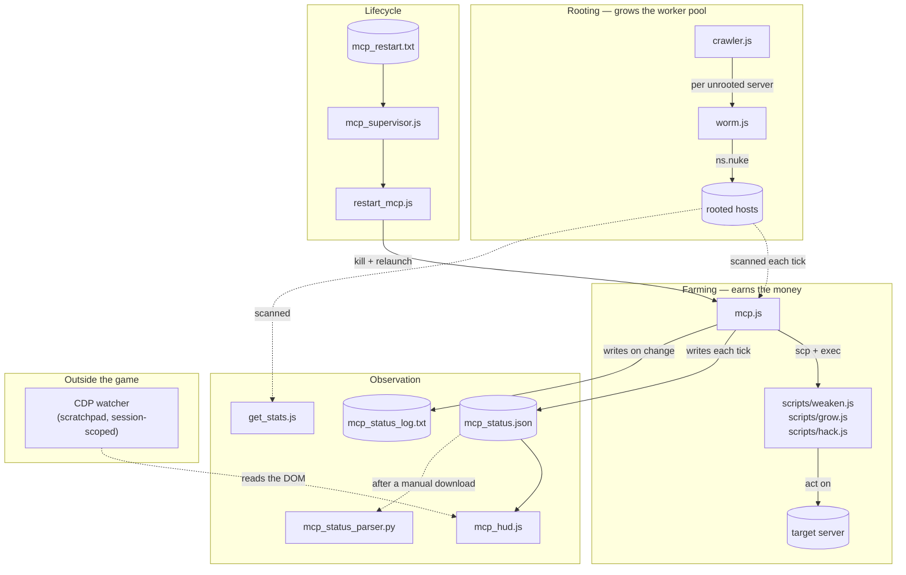

# Processes

What each script is, what it reads and writes, and how they fit together —
from rooting a server through to restarting the bot without a keystroke.

`CLAUDE.md` covers the environment constraints and working rules; the audit
reports in this directory cover *why* the current design is what it is. This
file is the map.

Keep it current. If a script gains an argument, a file, or a failure mode,
it changes here in the same commit.

---

## The map



Two things are worth reading off that diagram:

- **Nothing in `mcp.js` roots servers.** The worker pool only grows while
  `crawler.js` is running and you own the port-opener `.exe`s each server
  needs. If the bot looks starved for RAM, check the crawler first.
- **`mcp_status.json` is the single source of truth for observation.** The HUD
  reads it, the parser reads it, and the out-of-game watcher reads the HUD.
  Nothing downstream re-derives the numbers, so nothing downstream can
  disagree with the orchestrator about what is happening.

---

## Rooting

### `hacking/crawler.js`

Breadth-first walk of the network, forever. For each server that is unrooted,
within your hacking level, and not in `IGNORE`, it runs `worm.js` against it.
Sleeps 2 minutes between sweeps.

- **Start:** `run hacking/crawler.js`
- **Reads/writes:** nothing on disk
- **Stop condition:** none, runs until killed

**Known bug:** `let serv_set = Array(servers)` should be `Array.from(servers)`.
`Array(x)` with a single non-number argument produces `[x]` — a one-element
array containing the seed list — so `serv_set.includes(con)` never matches any
of home's immediate neighbours and they get re-queued on every rediscovery.
Wasteful, not fatal: the `hasRootAccess` check makes the repeat visits no-ops.

### `hacking/worm.js`

Opens as many ports as it has `.exe`s for, then `ns.nuke()`s a single server.

- **Start:** normally by `crawler.js`; manually `run hacking/worm.js <server>`
- **Exits early** if the server needs more ports than it can open
- **Dangling reference:** on success against `CSEC`, `avmnite-02h`, `I.I.I.I`,
  or `run4theh111z` it execs `hacking/backdoor.js`, which is **not in this
  repo**. `ns.exec` returns 0 and the failure is silent.

After an augmentation install your `.exe`s are gone and hacking level resets,
so the pool shrinks to what needs no ports. Rebuilding it means Create Program
(or buying from the darkweb) before the crawler can make progress again.

---

## Farming

### `mcp.js`

The orchestrator, and where nearly all the complexity lives. Each tick
(`LOOP_SLEEP_MS`, 10s) it scans the network, decides on a target, decides on a
plan, and allocates worker threads across every rooted host.

- **Start:** `run mcp.js` — optionally `run mcp.js target=<hostname>`
- **Writes:** `mcp_status.json` (every tick, overwritten),
  `mcp_status_log.txt` (appended only when target/plan/bucket changes),
  `mcp_target_state.json` (exclusions, so they survive a restart)
- **Deploys:** `/scripts/weaken.js`, `/scripts/grow.js`, `/scripts/hack.js`

**Argument:** `target=<hostname>` pins the target, bypassing selection. It is
validated against the scanned network — a name that isn't a hackable server is
rejected at startup rather than silently ignored.

**The tick, in order:**

1. Scan the network; identify rooted hosts with RAM (`workers`).
2. Compute `maxWeaken` — the weaken threads the pool *could* run if the RAM
   currently held by our own action scripts were reclaimed. Counting only free
   RAM here was the bug that pinned `maxWeaken` at 0 for 98.8% of ticks.
3. If a target is held: check whether it is **stuck** (security not falling)
   or **degraded** (money sustainably low *and* declining, or rate dropped).
   Either marks it excluded and clears the target.
4. Evaluate the **opportunity switch** — see below.
5. If no target, pick one: highest potential income discounted by readiness.
6. Build a **plan**: `weaken` if security exceeds the cap, otherwise `work`
   with a hack/grow/weaken weighting chosen by how full the target is.
7. Allocate threads per host, redeploying only hosts whose running actions no
   longer match the plan.
8. Write status.

**Target exclusions are preferences, not bans.** If nothing qualifies,
selection reruns ignoring exclusions. Without that fallback the bot livelocked
after an augmentation: it drained its only reachable target, excluded it, and
then sat idle killing scripts every 60 seconds.

**Redeploy is conditional.** Hack, grow and weaken take 60–240 seconds; the
tick is 10. Killing and re-execing every tick meant no action ever completed.
`hostNeedsRedeploy` is what stops that.

#### The opportunity switch

Adoption only happens when there is no current target, and both abandonment
paths assume a target eventually runs dry. Once grow keeps pace with hack, a
target can be farmed sustainably forever — it never degrades and never empties
— so without this the bot would farm the smallest server on the network
indefinitely while richer ones sat untouched.

Two regimes, because the fair comparison differs:

| Current target | Compared on | Minimum hold |
| --- | --- | --- |
| producing nothing (`empty` bucket) | readiness-discounted score | `MIN_TARGET_HOLD_MS` (60s) |
| productive | raw potential | `MIN_TARGET_COMMIT_MS` (600s) |

It switches when the best alternative beats the current one by more than
`OPPORTUNITY_SWITCH_FACTOR` (3×) *and* the hold timer has elapsed.

The predicate is evaluated **every tick** and recorded as `switchEval` in the
status file, even when the hold timer forbids acting on it. That is deliberate:
the two blockers demand different responses. Losing on score means the 3×
factor is what stands between the bot and a richer server. Losing on the hold
timer just means waiting. `blockedBy` names which.

#### Tunables

Constants at the top of the file. The ones that actually get retuned:

| Constant | Current | What it governs |
| --- | --- | --- |
| `SECURITY_CAP` | 6 | Above this, the plan is pure weaken |
| `WORK_SECURITY_MARGIN` | 1.5 | Absolute headroom kept during `work` |
| `TARGET_MONEY_GOAL` | 0.95 | Money fraction the `goal` bucket aims at |
| `DEGRADED_MONEY_PCT` | 0.05 | Drain threshold — **must** stay below the `empty` bucket's 0.1 |
| `OPPORTUNITY_SWITCH_FACTOR` | 3 | Margin required to abandon a working target |
| `LOOP_SLEEP_MS` | 10000 | Tick length |

Changing any of these requires a restart, which also wipes `rateSamples`,
`moneyPctSamples` and `totalHacked`. A hot-reloaded `mcp_config.json` is the
top item in the process backlog for exactly this reason.

### `scripts/weaken.js`, `scripts/grow.js`, `scripts/hack.js`

Three lines each: loop forever calling the one NS function on `ns.args[0]`.
All the intelligence is in how many threads `mcp.js` starts and when it kills
them. Keeping them dumb is what makes thread count the only control surface.

`mcp.js` copies these to each worker itself; it does not use the helpers in
`scripts/`.

---

## Observation

### `mcp_hud.js`

The terse panel — "is it healthy?" at a glance, sized to sit under the game's
own Overview.

- **Start:** `run mcp_hud.js` — optional `x= y= w= h=` in pixels
- **Reads:** `mcp_status.json`. It measures nothing itself, so it cannot
  disagree with the orchestrator.
- **Cost:** ~2.35GB (1.6GB baseline plus `ns.ps` + `ns.kill`)
- Re-running supersedes the previous instance instead of opening a second
  window, so repositioning is just a re-run.

```
+--------------------------+
|OK              foodnstuff|   verdict + target
|plan                  work|
|money 93%         sec 5.42|
|rate 112k       avg 98.00k|
|wkn 40/210    w40 g300 h12|   needed/available, then live threads
|ram 97%           19 hosts|
|lvl 341               920m|
|next phantasy       1.8/3x|   see below
|tick 10.1s          age 0s|
+--------------------------+
```

The first word is a verdict — `OK`, `WEAKEN` (needs more weaken than the pool
can supply), `DRAINED`, `SLOW`, `STALE`, `NO DATA` — and every line beneath it
carries an input to that verdict, so it never asks you to trust the summary
alone.

`age` matters most: without it, a dead `mcp.js` would leave the panel showing
frozen-but-plausible numbers indefinitely.

The `next` row renders `switchEval` in three states:

| Shown | Meaning |
| --- | --- |
| `= current` | Nothing outranks the current target. Working as intended. |
| `hold 460s` | A better target exists; the commit timer is still running. |
| `1.8/3x` | A better target exists but isn't winning by enough. |

### `get_stats.js`

The wide view: one line per rooted server with money, security, RAM and what
it is currently running. Auto-sizes its tail window to the text using real
font metrics from `ns.ui.getStyles()`, and parks itself beside the sidebar.

- **Start:** `run get_stats.js`, or `run get_stats.js <server> [<server>…]`
  to restrict it
- **Reads:** the live game. This one *does* measure independently.

### `mcp_status.js`

Mirrors `mcp.js`'s tail output into its own window, so the orchestrator's
`ns.print` lines stay visible without hunting for its tail.

- **Start:** `run mcp_status.js [host] [lines]` (defaults `home`, 20)
- `tail_mcp.js` is a near-identical earlier version. Prefer `mcp_status.js`.

### `mcp_status_parser.py` / `mcp_status_parser.js`

Local, out-of-game. Pretty-prints `mcp_status.json` including per-host
allocations, once that file has been pulled out of the game.

Pull it with the extension's **Download Files Matching Pattern…** and exactly
`mcp_*.{json,txt}`. Never bulk-download — see `CLAUDE.md` for why that
overwrites local source and then pushes the stale copy back.

Largely superseded by reading the game directly over CDP, but it still works
and needs nothing running.

---

## Lifecycle

Bitburner does not hot-reload. A running script keeps executing the version it
started with, so every code change needs a kill and relaunch. These two close
that loop.

### `restart_mcp.js`

Kills `mcp.js` on home, waits for it to actually be gone, relaunches it with
whatever args it was given.

- **Start:** `run restart_mcp.js [target=<hostname>]`

It polls `ns.scriptRunning` against a 10s deadline rather than sleeping a fixed
interval. A killed script can still finish its in-flight tick, including
writing `mcp_status.json` and `mcp_target_state.json` — starting the
replacement on a timer races those writes, and the new instance can load target
state the old one is about to overwrite.

### `mcp_supervisor.js`

Watches `mcp_restart.txt` and runs `restart_mcp.js` when its contents change.
This is what makes a restart triggerable from outside the game: write a new
token to the file, the sync extension pushes it in, the supervisor acts.

- **Start:** `run mcp_supervisor.js` — **this one still needs a human, once**
- **Protocol:** first line is the token, any further lines are passed to
  `mcp.js` as arguments (so `target=n00dles` can be requested remotely)
- **Cost:** ~2.6GB

It compares tokens rather than deleting the flag, specifically to keep RAM
down: `ns.read` costs 0GB and returns `""` for a missing file, so it needs
neither `ns.fileExists` (0.1GB) nor `ns.rm` (1GB). It seeds from whatever is
already on disk at startup, so restarting the supervisor doesn't immediately
re-trigger on a stale token.

---

## Outside the game

### The CDP watcher

Not in this repo — it lives in the session scratchpad, because it is
session-scoped by nature.

Bitburner runs under Electron. Launched with `--remote-debugging-port=9222`,
its page is reachable over the Chrome DevTools Protocol, which means the DOM —
including the Overview panel and every open tail window — can be read from
outside. `appSaveFns` is also exposed on the page.

A small Node poller reads that every 60s and prints a line **only when the
health state changes**: a non-`OK` HUD verdict, no money and no XP gain for ten
minutes, or the game becoming unreachable. Attached to a monitor, each printed
line wakes Claude mid-session without anyone typing.

This is why the HUD's verdict word is the first thing on the first line: it is
the machine-readable handle. Anything that lands there becomes something that
can raise an alarm.

**Limits worth stating plainly.** It dies when the session ends — it is not a
daemon. Each event costs a turn, which is why the filter watches transitions
rather than ticks. And it observes; it does not act.

---

## Legacy and unused

Kept because they cost nothing and occasionally get read, but not part of any
current path. Nothing below is called by `mcp.js`.

| File | Status |
| --- | --- |
| `scripts/copyScripts.js`, `scripts/copy_scripts.js` | Byte-identical duplicates. `mcp.js` has its own `copyActionScripts`. |
| `scripts/execute.js` | Manual one-host deploy from before `mcp.js`. Calls `copy_scripts.js`. |
| `scripts/weakenGrowHack.js` | Sequential weaken→grow→hack in one thread. Superseded by separate action scripts. |
| `purchaseServer-8GB.js` | **Broken.** scp/execs `early-hack-template.js`, which is not in this repo. |
| `tail_mcp.js` | Earlier version of `mcp_status.js`. |

---

## Generated files

All gitignored — they are game output, and the log lives inside the save file,
so it must not grow without bound.

| File | Written by | Notes |
| --- | --- | --- |
| `mcp_status.json` | `mcp.js`, every tick | Overwritten. The observation source of truth. |
| `mcp_status_log.txt` | `mcp.js`, on state change | Appended. Logging every tick grew this ~800KB/day inside the save, burying the transitions that actually explain behaviour. |
| `mcp_target_state.json` | `mcp.js`, every tick | Exclusions, so a restart doesn't relearn them. |
| `mcp_restart.txt` | outside the game | Restart trigger. |
