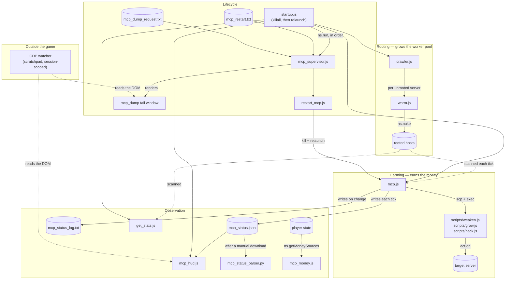

# Processes

What each script is, what it reads and writes, and how they fit together —
from rooting a server through to restarting the bot without a keystroke.

`CLAUDE.md` covers the environment constraints and working rules; the audit
reports in this directory cover *why* the current design is what it is. This
file is the map.

Keep it current. If a script gains an argument, a file, or a failure mode,
it changes here in the same commit.

---

## The map



Three things are worth reading off that diagram:

- **Nothing in `mcp.js` roots servers.** The worker pool only grows while
  `crawler.js` is running and you own the port-opener `.exe`s each server
  needs. If the bot looks starved for RAM, check the crawler first.
- **`mcp_status.json` is the single source of truth for observation.** The HUD
  reads it, the parser reads it, and the out-of-game watcher reads the HUD.
  Nothing downstream re-derives the numbers, so nothing downstream can
  disagree with the orchestrator about what is happening.
- **CDP reads the DOM, not the filesystem.** It can see the HUD's curated
  summary and now a full-file dump once rendered, but it can never call
  `ns.read()` directly — that only works from inside a running script. The
  supervisor's dump feature is the bridge: a local file write in, a rendered
  tail window out.
- **`startup.js` is the only other thing that still needs a human.** Once
  `mcp_supervisor.js` is up, restarts and dumps are remote-triggerable — but
  nothing can remote-*launch* a script that isn't running yet, including the
  supervisor itself. `run startup.js` (it kills everything else itself first)
  is the full recovery procedure after anything that wipes running scripts
  (an augmentation install, primarily).

---

## Rooting

### `hacking/crawler.js`

Breadth-first walk of the network, forever. For each server that is unrooted,
within your hacking level, and not in `IGNORE`, it runs `worm.js` against it.
Sleeps 2 minutes between sweeps.

- **Start:** `run hacking/crawler.js`
- **Reads/writes:** nothing on disk
- **Stop condition:** none, runs until killed

**Known bug:** `let serv_set = Array(servers)` should be `Array.from(servers)`.
`Array(x)` with a single non-number argument produces `[x]` — a one-element
array containing the seed list — so `serv_set.includes(con)` never matches any
of home's immediate neighbours and they get re-queued on every rediscovery.
Wasteful, not fatal: the `hasRootAccess` check makes the repeat visits no-ops.

### `hacking/worm.js`

Opens as many ports as it has `.exe`s for, then `ns.nuke()`s a single server.

- **Start:** normally by `crawler.js`; manually `run hacking/worm.js <server>`
- **Exits early** if the server needs more ports than it can open
- **Dangling reference:** on success against `CSEC`, `avmnite-02h`, `I.I.I.I`,
  or `run4theh111z` it execs `hacking/backdoor.js`, which is **not in this
  repo**. `ns.exec` returns 0 and the failure is silent.

After an augmentation install your `.exe`s are gone and hacking level resets,
so the pool shrinks to what needs no ports. Rebuilding it means Create Program
(or buying from the darkweb) before the crawler can make progress again.

---

## Farming

### `mcp.js`

The orchestrator, and where nearly all the complexity lives. Each tick
(`LOOP_SLEEP_MS`, 10s) it scans the network, decides on a target, decides on a
plan, and allocates worker threads across every rooted host.

- **Start:** `run mcp.js` — optionally `run mcp.js target=<hostname>`
- **Reads:** `mcp_config.json` every tick (see Tunables)
- **Writes:** `mcp_status.json` (every tick, overwritten),
  `mcp_status_log.txt` (appended only when target/plan/bucket changes),
  `mcp_events.txt` (one line per transition),
  `mcp_target_state.json` (exclusions, so they survive a restart)
- **Deploys:** `/scripts/weaken.js`, `/scripts/grow.js`, `/scripts/hack.js`

**Argument:** `target=<hostname>` pins the target, bypassing selection. It is
validated against the scanned network — a name that isn't a hackable server is
rejected at startup rather than silently ignored.

**The tick, in order:**

1. Scan the network; identify rooted hosts with RAM (`workers`).
2. Compute `maxWeaken` — the weaken threads the pool *could* run if the RAM
   currently held by our own action scripts were reclaimed. Counting only free
   RAM here was the bug that pinned `maxWeaken` at 0 for 98.8% of ticks.
3. If a target is held: check whether it is **stuck** (security not falling)
   or **degraded** (money sustainably low *and* declining, or rate dropped).
   Either marks it excluded and clears the target.
4. Evaluate the **opportunity switch** — see below.
5. If no target, pick one: highest potential income discounted by readiness.
6. Build a **plan**: `weaken` if security exceeds the cap, otherwise `work`
   with a hack/grow/weaken weighting chosen by how full the target is.
7. Allocate threads per host, redeploying only hosts whose running actions no
   longer match the plan.
8. Write status.

**Target exclusions are preferences, not bans.** If nothing qualifies,
selection reruns ignoring exclusions. Without that fallback the bot livelocked
after an augmentation: it drained its only reachable target, excluded it, and
then sat idle killing scripts every 60 seconds.

**Redeploy is conditional.** Hack, grow and weaken take 60–240 seconds; the
tick is 10. Killing and re-execing every tick meant no action ever completed.
`hostNeedsRedeploy` is what stops that.

#### The opportunity switch

Adoption only happens when there is no current target, and both abandonment
paths assume a target eventually runs dry. Once grow keeps pace with hack, a
target can be farmed sustainably forever — it never degrades and never empties
— so without this the bot would farm the smallest server on the network
indefinitely while richer ones sat untouched.

Two regimes, because the fair comparison differs:

| Current target | Compared on | Minimum hold |
| --- | --- | --- |
| producing nothing (`empty` bucket) | readiness-discounted score | `MIN_TARGET_HOLD_MS` (60s) |
| productive | raw potential | `MIN_TARGET_COMMIT_MS` (600s) |

It switches when the best alternative beats the current one by more than
`OPPORTUNITY_SWITCH_FACTOR` (3×) *and* the hold timer has elapsed.

The predicate is evaluated **every tick** and recorded as `switchEval` in the
status file, even when the hold timer forbids acting on it. That is deliberate:
the two blockers demand different responses. Losing on score means the 3×
factor is what stands between the bot and a richer server. Losing on the hold
timer just means waiting. `blockedBy` names which.

#### Tunables — `mcp_config.json`

**Re-read at the top of every tick. No restart needed.** That matters because
a restart wipes `rateSamples`, `moneyPctSamples`, `totalHacked` and
`lastSwitchTime` — automating restarts made the evidence-destruction cycle
faster, not smaller. Editing the config is the only way to change a constant
and still have the history that says whether it helped.

The ones that actually get retuned:

| Key | Default | What it governs |
| --- | --- | --- |
| `SECURITY_CAP` | 6 | Above this, the plan is pure weaken |
| `WORK_SECURITY_MARGIN` | 1.5 | Absolute headroom kept during `work` |
| `TARGET_MONEY_GOAL` | 0.95 | Money fraction the `goal` bucket aims at |
| `DEGRADED_MONEY_PCT` | 0.05 | Drain threshold — **must** stay below the `empty` bucket's 0.1, and an invariant enforces it |
| `OPPORTUNITY_SWITCH_FACTOR` | 3 | Margin required to abandon a working target |
| `LOOP_SLEEP_MS` | 10000 | Tick length |

Eleven more are configurable; the file in the repo lists all fifteen with
their defaults. Rules: only numbers are accepted, unknown keys are rejected
and reported, and **corrupt JSON keeps the current values** rather than
reverting to defaults — a half-saved file should not silently undo a
deliberate tune. Every change emits a `config_change` event with a diff, and
the effective config rides in `mcp_status.json` so an edit can be confirmed to
have taken.

#### Telemetry

Three things stamp or check every tick:

- **`runId` + `scriptVersion`.** mcp hashes its own source (djb2 — a retuned
  constant is exactly the same-size edit a length check would miss) and stamps
  it into every status write and every event. `mcp_hud.js` hashes `mcp.js`
  itself and compares, so **version drift shows up as an `OLD CODE` verdict.**
  This exists because the loop now edits code here, lets the sync watcher push
  it, and restarts by writing a token — nobody looks at the game in between,
  so "is the running code the code on disk?" gets asked constantly and was
  previously unanswerable.
- **`formatStatus(status)`** is the single field list. The tail line and the
  log line both derive from it. Add a field to `status`; that function is the
  only place deciding how it renders. Three parallel hand-maintained lists is
  how `lowMoneySeconds` reached `ns.print` only, and `switchEval` the JSON
  only — the same miss, twelve hours apart.
- **Invariants**, which assert on the code's own intentions and never on game
  state. Game state may surprise us; our own bookkeeping may not. A violation
  toasts once per name per run and increments a counter in the status file,
  which the HUD renders and the out-of-game watcher wakes on.

| Invariant | Catches |
| --- | --- |
| `eventLogWrites` | A write to `mcp_events.txt` failing — this is what caught the file's own invalid-extension bug, see below |
| `weakenBudgetNonNegative` | Budget over-allocation, found originally only by an accident of two fields lining up |
| `tickWithinBounds` | The 70–380s ticks that silently multiplied every rate |
| `poolNotIdle` | The network sitting 93% idle during weaken phases |
| `threadsFitHost` | The inconsistent-RAM class (`usedRam 3.5, freeRam 16, maxRam 16`) |
| `drainBelowEmptyTier` | A config edit that would strand recovering targets |
| `configParses` | A malformed `mcp_config.json` |

### `mcp_events.txt`

Content is JSON-lines (one JSON object per line), but the extension is
`.txt`, not `.jsonl` — Bitburner's `ns.write` only accepts a path ending in
`.txt`/`.json`/`.css` or a script extension; anything else throws `File path
should be a text file or script`. This is the same bug class as the `.log`
lesson elsewhere in this project, and it hit this file specifically for its
entire first day: every write threw, caught by a try/catch and printed only
to `ns.print`, so the file never actually existed in the game — invisible
because the in-memory ring buffer that feeds `recentEvents` in the status
file kept working regardless of whether the write succeeded, so everything
*looked* fine. Found only by checking why a correctly-set download pattern
still wasn't pulling the file down. Now caught structurally: a write failure
here trips the `eventLogWrites` invariant, so a future extension mistake
toasts instead of vanishing silently.

One line per transition — `startup`, `target_adopt`, `target_drop`,
`degraded_held`, `plan_flip`, `bucket_change`, `stall`, `config_change`,
`invariant_violation`. Never per tick.

The rule that makes it worth having:

> An event records the value of every variable that appeared in the predicate
> that fired it — not the state afterward.

So a `target_drop` for `drained` carries the whole sample array, `declining`,
`rateDropped`, `lastAvgRate`, `heldMs` and every threshold involved. A wrong
theory dies on reading. The same event carrying only `{reason: "drained"}`
costs three restart cycles to disambiguate, because the reader has to infer
backwards from effect to cause — which is exactly where this project
repeatedly lost hours.

Trimmed to the last 300 lines at startup, so it stays bounded inside the save
file while still surviving the restarts that wipe every in-memory sample. The
most recent 20 also ride inline in `mcp_status.json`, so one read gives both
"now" and "how we got here".

### `scripts/weaken.js`, `scripts/grow.js`, `scripts/hack.js`

Three lines each: loop forever calling the one NS function on `ns.args[0]`.
All the intelligence is in how many threads `mcp.js` starts and when it kills
them. Keeping them dumb is what makes thread count the only control surface.

`mcp.js` copies these to each worker itself; it does not use the helpers in
`scripts/`.

---

## Observation

### `mcp_hud.js`

The terse panel — "is it healthy?" at a glance, sized to sit under the game's
own Overview.

- **Start:** `run mcp_hud.js` — optional `x= y= w= h=` in pixels
- **Reads:** `mcp_status.json`. It measures nothing itself, so it cannot
  disagree with the orchestrator.
- **Cost:** ~2.35GB (1.6GB baseline plus `ns.ps` + `ns.kill`)
- Re-running supersedes the previous instance instead of opening a second
  window, so repositioning is just a re-run — and now closes that instance's
  window too, not just its process. `ns.kill` alone doesn't close a script's
  tail window; found by observation after two `startup.js` runs left two
  visibly different "mcp" panels open while `ps` showed only one live
  process — the second was a frozen ghost from the instance the previous run
  had already killed. Fixed with `ns.ui.closeTail(pid)`, which exists
  specifically to close a window belonging to a script other than the
  caller. This only prevents *future* ghosts — a window already orphaned by
  an older, now-dead process has no live PID left for `ns.ps` to find, so it
  can't be closed programmatically and needs one manual click.

```
+--------------------------+
|OK              foodnstuff|   verdict + target
|plan                  work|
|money 93%         sec 5.42|
|rate 112k       avg 98.00k|
|wkn 40/210    w40 g300 h12|   needed/available, then live threads
|ram 97%           19 hosts|
|lvl 341     earned 45.20m|   see below
|next phantasy       1.8/3x|   see below
|ver ok               inv 0|   code drift, invariant violations
|tick 10.1s          age 0s|
|x=950                y=190|   see below
+--------------------------+
```

The first word is a verdict, and every line beneath it carries an input to
that verdict, so it never asks you to trust the summary alone. In priority
order:

| Verdict | Meaning |
| --- | --- |
| `NO DATA` | No readable `mcp_status.json` |
| `STALE` | Status older than 90s — mcp is wedged or dead |
| `OLD CODE` | The running mcp does not match `mcp.js` on disk |
| `INVARIANT` | One of mcp's own assertions has failed |
| `WEAKEN` | Needs more weaken threads than the pool can supply |
| `DRAINED` | Average money share below the drain threshold |
| `SLOW` | Tick longer than 30s |
| `OK` | — |

`OLD CODE` outranks every health signal deliberately: if the running code is
not the code on disk, every judgement below that line is about the wrong
program, and the fix is a restart rather than a diagnosis.

`age` matters nearly as much: without it, a dead `mcp.js` would leave the panel
showing frozen-but-plausible numbers indefinitely.

The `ver`/`inv` row is always rendered, including its reassuring zeros, so the
panel's height never changes — `placeTail` sizes once, and a row appearing
later would clip.

The `next` row renders `switchEval` in three states:

| Shown | Meaning |
| --- | --- |
| `= current` | Nothing outranks the current target. Working as intended. |
| `hold 460s` | A better target exists; the commit timer is still running. |
| `1.8/3x` | A better target exists but isn't winning by enough. |

The `lvl`/`earned` row shows `ns.getMoneySources().sinceInstall.hacking +
.crime` — cumulative, only ever added to by the game itself, so spending
(Hacknet, servers, anything) can never move it. This exists because total
player money couldn't answer "is anything actually earning" once heavy
Hacknet spending became routine — see the out-of-game watcher section below.
"Since install," not "since start," so it survives script and game restarts
and only resets on an actual augmentation install.

The `x=`/`y=` row echoes back whatever position was actually applied — the
args passed in, or the computed default if none were. Bitburner exposes no
getter for a tail window's current position or size anywhere in the `ns.ui`
cost table (checked directly, not assumed), so a manual drag can never be
read back by a script. This is the substitute: dialing in a position is
"adjust the number, see where it lands, read the confirmation," not "drag,
then capture." Every panel in this project that supports `x=`/`y=` carries
this same row for the same reason.

### `mcp_money.js`

A second small panel, independent of the HUD — start/stop/roll-up like any
tail window — answering a different question: not "is the bot healthy" but
"where is money actually coming from and going." Reads
`ns.getMoneySources().sinceInstall` directly (not `mcp_status.json` — this is
whole-player accounting, not specific to the bot's own target, so there's no
orchestrator-disagreement risk to design around).

- **Start:** `run mcp_money.js` — optional `x= y= w= h=`, same as `mcp_hud.js`,
  same echo-row substitute for the missing position getter
- **Cost:** 3.3GB (1.6GB baseline + `ns.getMoneySources` 1.0GB + `ns.ps`
  0.2GB + `ns.kill` 0.5GB)
- Shows every non-zero category, sorted by magnitude, plus a `total` line.
  Expense categories (`hacknet_expenses`, `gang_expenses`) render as negative
  numbers with no special-casing needed — confirmed against the game's own
  code, not assumed: `loseMoney()` calls
  `recordMoneySource(-1 * amount, category)`, so the sign is already correct
  at the source.

```
+------------------------------+
|since last aug                |
|total                    3.06b|
|hacking                  4.20b|
|hacknet_expenses         -890m|
|crime                     320m|
|hacknet                 15.00m|
|x=1050                   y=430|
+------------------------------+
```

### `get_stats.js`

The wide view: one line per rooted server with money, security, RAM and what
it is currently running. Auto-sizes its tail window to the text using real
font metrics from `ns.ui.getStyles()`, and parks itself beside the sidebar by
default.

- **Start:** `run get_stats.js`, or `run get_stats.js <server> [<server>…]`
  to restrict it — `x=`/`y=`/`w=`/`h=` also accepted, mixed in with server
  names in any order. They're filtered out by pattern (`/^[xywh]=[\d.]+$/`)
  before the remaining args are read as hostnames, so a real server named
  e.g. `xylophone` is never mistaken for a stray `x=` — verified before
  shipping, not just assumed safe.
- **Reads:** the live game. This one *does* measure independently.
- Carries the same `x=`/`y=` echo row as `mcp_hud.js`, for the same reason —
  no way to read a window's position back after a manual drag.

### `mcp_status.js`

Mirrors `mcp.js`'s tail output into its own window, so the orchestrator's
`ns.print` lines stay visible without hunting for its tail.

- **Start:** `run mcp_status.js [host] [lines]` (defaults `home`, 20)
- `tail_mcp.js` is a near-identical earlier version. Prefer `mcp_status.js`.

### `mcp_status_parser.py` / `mcp_status_parser.js`

Local, out-of-game. Pretty-prints `mcp_status.json` including per-host
allocations, once that file has been pulled out of the game.

Pull it with the extension's **Download Files Matching Pattern…** and exactly
`mcp_*.{json,txt}`. Never bulk-download — see `CLAUDE.md` for why that
overwrites local source and then pushes the stale copy back.

Largely superseded by reading the game directly over CDP, but it still works
and needs nothing running.

---

## Lifecycle

Bitburner does not hot-reload. A running script keeps executing the version it
started with, so every code change needs a kill and relaunch. These two close
that loop.

### `restart_mcp.js`

Kills `mcp.js` on home, waits for it to actually be gone, relaunches it with
whatever args it was given.

- **Start:** `run restart_mcp.js [target=<hostname>]`

It polls `ns.scriptRunning` against a 10s deadline rather than sleeping a fixed
interval. A killed script can still finish its in-flight tick, including
writing `mcp_status.json` and `mcp_target_state.json` — starting the
replacement on a timer races those writes, and the new instance can load target
state the old one is about to overwrite.

### `mcp_supervisor.js`

Watches two files for requests from outside the game. Both use token
comparison rather than deleting a flag, to keep RAM down: `ns.read` costs
0GB and returns `""` for a missing file, so neither needs `ns.fileExists`
(0.1GB) or `ns.rm` (1GB). Both seed from whatever is already on disk at
startup, so restarting the supervisor doesn't immediately re-trigger on a
stale token.

- **Start:** `run mcp_supervisor.js` — **this one still needs a human, once**
  (and again after any update to this script — Bitburner doesn't hot-reload,
  and the supervisor can't remote-restart itself; it self-supersedes on
  re-run so a second `run` cleanly replaces the first rather than stacking)
- **Cost:** 3.3GB — 1.6GB baseline + `ns.run` (1.0GB) + `ns.ps` (0.2GB) +
  `ns.kill` (0.5GB, for self-supersede). Every `ns.ui.*` call the dump
  feature uses is 0GB (checked against the game's own cost table, not
  assumed), so rendering itself added nothing to that figure.

**`mcp_restart.txt`** — runs `restart_mcp.js` when its contents change. First
line is a token, any further lines are passed to `mcp.js` as arguments (so
`target=n00dles` can be requested remotely).

**`mcp_dump_request.txt`** — renders a file's full contents into a tail
window titled `mcp_dump`, readable over CDP without a download. This exists
because the CDP connection can only read what's already rendered on
screen — the HUD deliberately shows a curated ~10-line summary, not full file
contents, and nothing outside the game can call `ns.read()` directly, since
that only works from inside a running script. Every deep-log finding this
session (the bucket-hysteresis thrashing, the invalid-extension write
failure) needed the actual file, which until this existed meant a manual
download every time.

- **Protocol:** line 1 a token/nonce (forces change-detection even when
  re-requesting the same file), line 2 the filename, optional line 3 a line
  count for non-JSON files
- `.json` files are pretty-printed whole (with a raw fallback if the content
  doesn't parse); everything else is tailed to the last N lines — default
  150, hard-capped at 500 regardless of what's requested, since
  `mcp_status_log.txt` has no size limit of its own and a request shouldn't
  be able to try rendering an unbounded file into the browser tab
- **Resolved, the hard way:** Bitburner's tail window only keeps in the DOM
  whatever fits its actual configured height — it is not a scrollable div
  with everything present underneath. A 100-line request originally rendered
  only ~45 lines over CDP (always the tail end); a 45-line request rendered
  completely. The window's height was being capped at 700px for assumed
  visual tidiness, silently dropping content CDP could read even though
  `ns.print` genuinely wrote all of it. Fixed by sizing the window tall
  enough to fit whatever was requested, uncapped, since nothing about this
  feature is optimizing for how the window looks.

### `startup.js`

Brings up the whole suite from a clean slate in **one** command:
`run startup.js`. Closes every open tail window, kills everything else on
the host, then launches `mcp_supervisor.js`, `hacking/crawler.js`, `mcp.js`,
`mcp_hud.js`, `get_stats.js` in that order via `ns.run`, then exits rather
than staying resident, so its own footprint doesn't compete with what it
just started.

- **Start:** `run startup.js` — the one command besides the supervisor's own
  bootstrap that still needs a human hand
- **Cost:** 4.3GB while running (momentary) — 1.6GB baseline + `ns.ps`
  (0.2GB) + `ns.killall` (0.5GB) + `ns.scriptRunning` (1.0GB) + `ns.run`
  (1.0GB)
- **Closes tail windows *before* killing, not after — order was a real bug.**
  `ns.kill`/`ns.killall` never close a script's tail window; it's orphaned,
  frozen on whatever it last rendered. `closeTail` needs a live PID from
  `ns.ps` to target, and `killall` erases that PID the instant it runs. Two
  actual `startup.js` runs each left a fresh ghost behind for `mcp_hud.js`
  and `get_stats.js` despite both scripts' own self-supersede logic already
  calling `closeTail` — their check runs from the *new* instance scanning
  `ns.ps` for a prior copy, and by the time it ran, `startup.js`'s own
  `killall` (which used to run first) had already erased that evidence. Now
  closes every window it can see, then kills.
- **Calls `ns.killall(host)`** — every other script on the host, including
  anything unrelated to the mcp suite, since "clean and fresh" was the
  explicit ask. Safe against killing itself: `safetyGuard` defaults to
  `true`, documented as "skips the script that calls this function" and
  confirmed against the actual implementation in the game's bundle (it
  compares the target PID to the caller's and excludes a match), not just
  the doc text.
- Still checks `ns.scriptRunning` before each launch even though `killall`
  already cleared the host — cheap, and belt-and-suspenders against an edge
  case rather than the primary duplicate-prevention it was before `killall`
  got folded in. Checked *without* passing arguments, since the function
  matches "any script with this filename" regardless of what it was started
  with (confirmed against the game's own doc text); a live
  `mcp.js target=n00dles` still correctly reads as running.
- `mcp_supervisor.js` launches first deliberately: once it's up, restarts and
  file dumps are remote-triggerable, so everything after it in the list is in
  principle also recoverable without repeating this script.
- Reports per-script outcome (`started (pid N)` / `already running,
  skipping` / `FAILED — not enough RAM?`) plus a one-line summary count, so a
  partial failure from insufficient home RAM is visible rather than silent.

---

## Outside the game

### The CDP watcher

Not in this repo — it lives in the session scratchpad, because it is
session-scoped by nature.

Bitburner runs under Electron. Launched with `--remote-debugging-port=9222`,
its page is reachable over the Chrome DevTools Protocol, which means the DOM —
including the Overview panel and every open tail window — can be read from
outside. `appSaveFns` is also exposed on the page.

A small Node poller reads that every 60s and prints a line **only when the
health state changes**: a non-`OK` HUD verdict, no money and no XP gain for ten
minutes, or the game becoming unreachable. Attached to a monitor, each printed
line wakes Claude mid-session without anyone typing.

This is why the HUD's verdict word is the first thing on the first line: it is
the machine-readable handle. Anything that lands there becomes something that
can raise an alarm.

**Limits worth stating plainly.** It dies when the session ends — it is not a
daemon. Each event costs a turn, which is why the filter watches transitions
rather than ticks. And it observes; it does not act.

---

## Darknet (`ns.dnet`)

A self-contained set, separate from everything above. It does not touch
`mcp.js` and is **not** auto-started by `startup.js` or `mcp_supervisor.js` —
deliberately, until it has worked by hand at least once.

**None of it has run in Bitburner yet.** Design reasoning lives in
`docs/darknet-functions.md` (API reference, model solvers, RAM costs),
`docs/darknet-tactics.md` (per-decision reasoning) and
`docs/darknet-strategy.md` (sequencing). The next real action is running
`dnet_probe.js` — see `docs/kensTodo.md`.

| File | Runs on | RAM (est.) | What it does |
| --- | --- | --- | --- |
| `dnet_probe.js` | `home` | ~2.3GB | First contact. Probes, reports each neighbour's details, attempts `authenticate("darkweb","")`. Mutates almost nothing. |
| `dnet_lib.js` | — | 0GB alone | Shared module. Model-aware password candidates, credential store, session acquisition. Not runnable. |
| `dnet_deploy.js` | `home`, then darknet | ~4.6GB | Roaming self-replicating deployer. Cracks, persists, spreads, follows mutations. |
| `dnet_loot.js` | a darknet server | ~5.0GB | Frees blocked RAM (gated on the free `getBlockedRam`), opens `.cache` files, reports karma spent. |
| `dnet_creds_merge.js` | `home` | ~2.0GB | Folds per-host credential shards into `dnet_creds.txt`. |

### Arguments

- `dnet_deploy.js` — `--once` (single pass, no loop), `--brute N` (allow up to
  N numeric candidates per host; default 0 = off), `--quiet`.
- `dnet_loot.js` — `--no-cache`, `--no-ram`, `--max-realloc N` (default 25).
- `dnet_creds_merge.js` — `--prune` (delete shards after merging), `--quiet`.

### Files

| File | Written by | Notes |
| --- | --- | --- |
| `dnet_creds.txt` | `dnet_deploy.js`, `dnet_creds_merge.js` | JSON-lines, one record per line: `{host, password, model, at}`. `.txt` not `.jsonl` — `ns.write` rejects `.jsonl`. Carried along on every `scp` so a child agent inherits what its parent knew. |
| `dnet_cred_<host>.txt` | `dnet_deploy.js` | Per-host shard, scp'd to `home`. Sharded so concurrent agents can't clobber one shared file. Hostnames are escaped (`meta:inc` → `metax3ainc`) because darknet hostnames contain `:`, `%`, `@` and emoji. |

Both are game output and should be gitignored if they ever land locally.
`dnet_creds.txt` is worth adding to the download pattern once the system is
live, so its contents are readable outside the game.

### Failure modes worth knowing

- **Response code 408 (`RequestTimeOut`) does not mean "wrong password."** The
  game rolls the instability timeout *after* the attempt resolves, so a correct
  password can return 408. `dnet_lib.js` retries 408 with the same password and
  only drops a candidate on 401. Any code that gets this wrong silently skips
  the right answer.
- **Backdoors, not authentications, drive instability.** Free allowance is 2;
  each one past that adds 3% to the global authentication timeout chance,
  capping at 50%. `dnet_deploy.js` never backdoors.
- **`openCache` costs karma** (`difficulty + 1` per cache). `dnet_loot.js`
  reports the total per run.
- **A stored password that starts returning 401** means the server restarted
  with a new one. `dnet_deploy.js` drops the stale credential and re-cracks.

---

## Legacy and unused

Kept because they cost nothing and occasionally get read, but not part of any
current path. Nothing below is called by `mcp.js`.

| File | Status |
| --- | --- |
| `scripts/copyScripts.js`, `scripts/copy_scripts.js` | Byte-identical duplicates. `mcp.js` has its own `copyActionScripts`. |
| `scripts/execute.js` | Manual one-host deploy from before `mcp.js`. Calls `copy_scripts.js`. |
| `scripts/weakenGrowHack.js` | Sequential weaken→grow→hack in one thread. Superseded by separate action scripts. |
| `purchaseServer-8GB.js` | **Broken.** scp/execs `early-hack-template.js`, which is not in this repo. |
| `tail_mcp.js` | Earlier version of `mcp_status.js`. |

---

## Generated files

All gitignored — they are game output, and the log lives inside the save file,
so it must not grow without bound.

| File | Written by | Notes |
| --- | --- | --- |
| `mcp_status.json` | `mcp.js`, every tick | Overwritten. The observation source of truth. Carries the last 20 events inline. |
| `mcp_events.txt` | `mcp.js`, per transition | Appended; trimmed to 300 lines at startup. Survives restarts, which is the point. |
| `mcp_status_log.txt` | `mcp.js`, on state change | Appended. Logging every tick grew this ~800KB/day inside the save, burying the transitions that actually explain behaviour. |
| `mcp_target_state.json` | `mcp.js`, every tick | Exclusions, so a restart doesn't relearn them. |
| `mcp_restart.txt` | outside the game | Restart trigger. |

`mcp_config.json` is **not** generated and **is** committed — it is an input we
author, and it needs to be in the repo to sync into the game.
